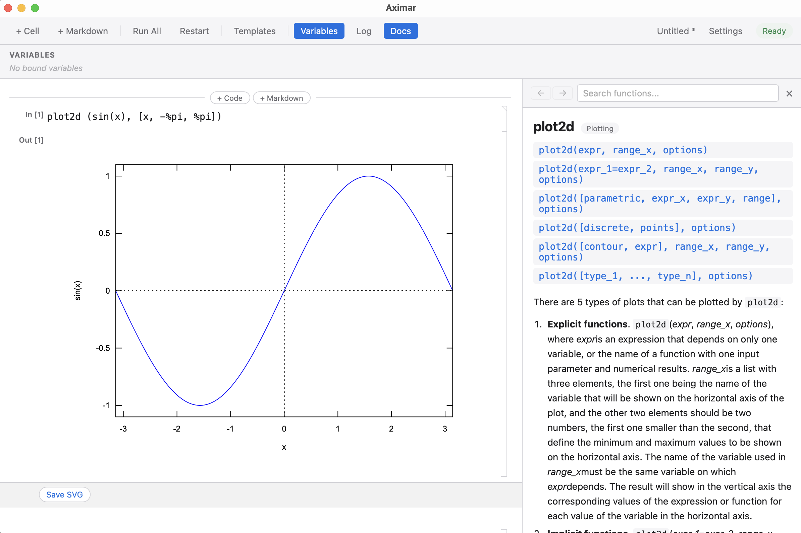

# Aximar

A modern, cross-platform desktop GUI for the [Maxima](https://maxima.sourceforge.io/) computer algebra system. Aximar provides a notebook-style interface with beautifully rendered math output via KaTeX.

Built with [Tauri v2](https://tauri.app/) (Rust backend) and React + TypeScript (frontend).



See the [vector calculus example](assets/vc.pdf) for a Stokes' theorem verification notebook.

## Features

- **Notebook interface** — code and markdown cells with drag-to-reorder
- **LaTeX math rendering** — Maxima output rendered with KaTeX
- **Interactive plots** — Plotly.js charts via `ax_draw2d`, `ax_draw3d`, `ax_plot2d`, and `ax_polar`, with pan, zoom, and hover. Includes contour plots, heatmaps, bar charts, histograms, vector fields, and phase portraits
- **Classic plots** — Maxima's built-in `plot2d` and `plot3d` rendered as inline SVGs
- **Function discovery** — searchable catalog of 2500+ functions, docs panel, hover tooltips
- **Command palette** — quick access to functions and categories (Ctrl+K / Cmd+K)
- **Smart editor** — syntax highlighting, autocomplete, signature hints
- **Find & replace** — search across cells with regex support
- **Error enhancement** — friendly explanations, "did you mean?" suggestions, correct signatures
- **Variables panel** — inspect and manage bound variables
- **Templates** — starter notebooks for calculus, linear algebra, plotting, and more
- **Dark/light/auto theme** — follows your system preference or set manually
- **MCP server** — AI integration via Model Context Protocol, with built-in setup for Claude Code, Codex, and Gemini CLI
- **Multiple backends** — run Maxima locally, in Docker/Podman, or via WSL
- **Save & load** — persist notebooks in Jupyter-compatible format
- **Print support** — configurable margins and font sizes for printing

## Getting Started

### Installing Maxima

Aximar requires a working [Maxima](https://maxima.sourceforge.io/) installation.

| Platform | Install |
|----------|---------|
| macOS (Homebrew) | `brew install maxima` |
| Ubuntu/Debian | `sudo apt install maxima` |
| Fedora | `sudo dnf install maxima` |
| Windows | See [Windows setup](#windows-setup) below |

### Windows Setup

On Windows you have three options for running Maxima:

**Option 1: Native Windows install (Local backend)**

Download and install Maxima from [sourceforge.net/projects/maxima](https://sourceforge.net/projects/maxima/). Aximar will automatically detect installations at `C:\maxima-*\bin\maxima.bat`. You can also set a custom path in Settings.

**Option 2: WSL backend**

If you use [Windows Subsystem for Linux](https://learn.microsoft.com/en-us/windows/wsl/install), you can run Maxima inside a WSL distribution:

1. Install Maxima in your WSL distro (e.g. `sudo apt install maxima`)
2. In Aximar, open Settings and set the backend to **WSL**
3. Select your distro from the dropdown — Aximar will show whether Maxima was found

Plotting works automatically — Aximar copies rendered SVGs from the WSL filesystem to a local temp directory.

**Option 3: Docker/Podman backend**

Run Maxima in a container for full isolation:

1. Install [Docker Desktop](https://www.docker.com/products/docker-desktop/) or [Podman](https://podman.io/)
2. Pull a Maxima image (e.g. `docker pull maxima/maxima`)
3. In Aximar, set the backend to **Docker**, choose your engine, and enter the image name

### Maxima detection order

Aximar looks for the `maxima` binary in these locations (local backend):

1. `AXIMAR_MAXIMA_PATH` environment variable
2. `/opt/homebrew/bin/maxima`, `/usr/local/bin/maxima`, `/usr/bin/maxima`
3. Windows: `C:\maxima-*\bin\maxima.bat`
4. Falls back to `maxima` on `PATH`

## Using the App

### Cells

- **Type a Maxima expression** in a cell (e.g. `integrate(x^2, x);`)
- **Shift+Enter** — evaluate the cell and create a new cell below
- **Ctrl/Cmd+Enter** — evaluate in place
- **+ Cell / + Markdown** — add code or markdown cells
- **Run All** — evaluate all cells in order
- **Restart** — restart the Maxima session (clears Maxima state, not your cells)

### Keyboard shortcuts

Hold Ctrl (or Cmd on Mac) to see all shortcuts. Key bindings include:

| Shortcut | Action |
|----------|--------|
| Shift+Enter | Evaluate and advance |
| Ctrl/Cmd+Enter | Evaluate in place |
| Ctrl/Cmd+K | Command palette |
| Ctrl/Cmd+Z | Undo |
| Ctrl/Cmd+Shift+Z | Redo |
| Ctrl/Cmd+F | Find |
| Ctrl/Cmd+Shift+F | Find & replace |
| Ctrl/Cmd+D | Delete cell |
| Ctrl/Cmd+Shift+Up/Down | Move cell |
| \\ | Symbol entry — type a LaTeX name (e.g. `\alpha`, `\leq`, `\nabla`) to insert Unicode |

### Settings

Open Settings from the toolbar to configure:

- **Theme** — auto, light, or dark
- **Cell style** — card or bracket
- **Backend** — local, Docker, or WSL
- **Font sizes** — editor and print
- **Markdown font** — sans-serif, serif, Computer Modern, or mono
- **Evaluation timeout** — 10s to 120s
- **Print margins** — top, bottom, left, right (mm)

### Logging

The status bar at the bottom of the app shows the most recent event. Click it to open the log window with two tabs:

- **App Log** — session events, evaluation results, warnings, and errors
- **Maxima Output** — raw stdin/stdout/stderr from the Maxima process (useful for debugging)

### Example expressions

```
integrate(x^2, x);
diff(sin(x)*cos(x), x);
solve(x^2 - 5*x + 6 = 0, x);
expand((a + b)^4);
factor(x^4 - 1);
taylor(exp(x), x, 0, 5);
```

### Plotting

Aximar provides its own `ax_*` plotting functions that render as interactive Plotly.js charts with pan, zoom, and hover. These are auto-loaded — no `load(...)` needed.

```
/* Interactive 2D plot */
ax_plot2d(sin(x), [x, -%pi, %pi])$

/* Multiple curves with styling */
ax_draw2d(
  color="red", explicit(sin(x), x, -%pi, %pi),
  color="blue", explicit(cos(x), x, -%pi, %pi),
  title="Trig Functions"
)$

/* 3D surface */
ax_draw3d(explicit(sin(x)*cos(y), x, -%pi, %pi, y, -%pi, %pi))$

/* Polar plot */
ax_polar(1 + cos(θ), [θ, 0, 2*%pi])$

/* Contour plot */
ax_draw2d(ax_contour(sin(x)*cos(y), x, -%pi, %pi, y, -%pi, %pi), colorscale="Viridis")$

/* Bar chart */
ax_draw2d(ax_bar(["Q1","Q2","Q3","Q4"], [100,150,120,180]), title="Sales")$

/* Vector field with phase portrait */
ax_draw2d(
  color="#cccccc", ax_vector_field(-y, x, x, -3, 3, y, -3, 3),
  color="red", ax_streamline(-y, x, x, -3, 3, y, -3, 3),
  aspect_ratio=true, title="Phase Portrait"
)$
```

Maxima's built-in `plot2d` and `plot3d` are also supported and render as inline SVGs.

## MCP Server (AI Integration)

Aximar exposes its capabilities via the [Model Context Protocol](https://modelcontextprotocol.io/), letting AI assistants search function docs, manage notebook cells, run Maxima expressions, and inspect session state. There are 21 tools available — see `docs/mcp-server.md` for the full list.

### Connected mode (recommended)

When the Aximar app is running, enable the MCP server in Settings. It listens on `localhost:19542` with bearer token authentication.

**One-click setup** — Settings shows **Configure** buttons for [Claude Code](https://docs.anthropic.com/en/docs/claude-code) and [Codex](https://github.com/openai/codex) that automatically register the MCP server with the correct URL and auth token. No manual config needed.

You can also configure manually:

```bash
# Claude Code
claude mcp add --transport http \
  --header "Authorization: Bearer <token>" \
  -- aximar http://localhost:19542/mcp

# Codex — add to ~/.codex/config.toml:
# [mcp_servers.aximar]
# url = "http://localhost:19542/mcp"
# http_headers = { "Authorization" = "Bearer <token>" }
```

### Headless mode

The standalone `aximar-mcp` binary runs its own Maxima session over stdio, without the GUI.

```bash
# Build it
cargo build -p aximar-mcp --release

# Register with Claude Code
claude mcp add aximar -- ./target/release/aximar-mcp
```

Verify either mode is working:

```bash
claude mcp list
```

## Building from Source

### Prerequisites

- [Node.js](https://nodejs.org/) >= 18
- [Rust](https://rustup.rs/) (stable toolchain)
- Tauri v2 system dependencies — see the [Tauri prerequisites guide](https://tauri.app/start/prerequisites/)

### Development

```bash
npm install
npm run tauri dev
```

This starts both the Vite dev server (frontend hot-reload) and the Tauri Rust backend.

### Release build

```bash
npm run tauri build
```

Build artifacts are placed in `src-tauri/target/release/bundle/`:
- macOS: `.app` bundle and `.dmg`
- Linux: `.AppImage` and `.deb`
- Windows: `.msi` installer

### Running tests

```bash
# Rust unit tests (all workspace crates)
cargo test --workspace

# TypeScript type checking
npx tsc --noEmit
```

## Architecture

The app communicates with Maxima through a long-lived subprocess. The Rust backend manages this process, sending expressions via stdin and reading results from stdout using a sentinel-based protocol. See `docs/maxima-protocol.md` for details.

```
React Frontend  <->  Tauri IPC  <->  Rust Backend  <->  Maxima subprocess
                                                         (stdin/stdout)
```

| Layer | Technology |
|-------|-----------|
| Desktop shell | Tauri v2 |
| Frontend | React 19, TypeScript, Vite |
| Code editor | CodeMirror 6 |
| Interactive plots | Plotly.js |
| Math rendering | KaTeX |
| State management | Zustand |
| Subprocess I/O | tokio::process |

## Alternatives

- **[wxMaxima](https://wxmaxima-developers.github.io/wxmaxima/)** — the long-established GUI for Maxima, built with wxWidgets. wxMaxima offers a mature feature set including interactive animations with slider controls, `table_form()` for tabular data display, and notebook export to HTML/LaTeX. Aximar aims to provide a more modern interface and cross-platform experience via Tauri, but wxMaxima remains an excellent choice — especially if you need animation support or `.wxm`/`.wxmx` file compatibility.

## License

GPL-3.0-or-later
